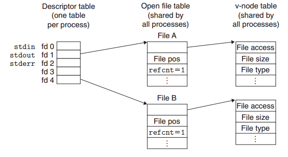
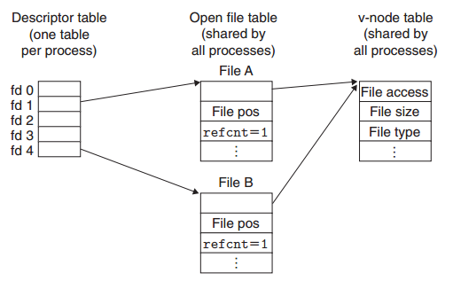
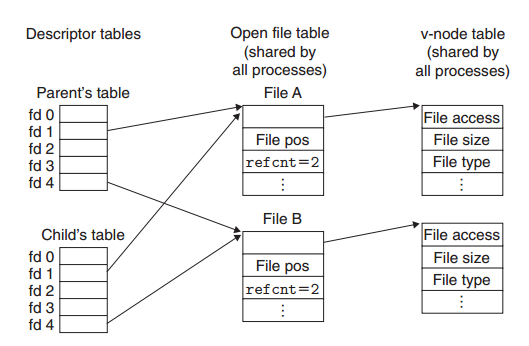
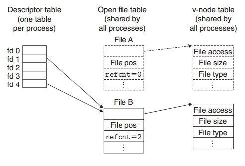
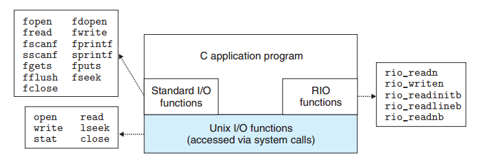

# 系统级I/O
<!-- TOC -->

- [系统级I/O](#系统级io)
- [1. I/O的基本操作](#1-io的基本操作)
- [2. 文件](#2-文件)
- [3. 打开和关闭文件](#3-打开和关闭文件)
- [4. 读与写文件](#4-读与写文件)
- [5. 使用ROI包健壮地读写](#5-使用roi包健壮地读写)
    - [5.1. 不带缓冲的输入，输出函数](#51-不带缓冲的输入输出函数)
    - [5.2. 带缓冲的输入函数](#52-带缓冲的输入函数)
- [6. 读取文件元数据](#6-读取文件元数据)
- [7. 读取目录内容](#7-读取目录内容)
- [8. 进程之间是如何共享文件的](#8-进程之间是如何共享文件的)
- [9. I/O重定向](#9-io重定向)
- [10. 对于I/O函数的使用建议](#10-对于io函数的使用建议)

<!-- /TOC -->

输入/输出（I/O）是在主存和外部设备（例如磁盘驱动器、终端和网络）之间复制数据的过程。

- 输入：从I/O设备复制数据到主存
- 输出：从主存复制数据到I/O设备


几乎所有编程语言都提供了执行I/O的较高级的工具（函数或类）。在ANSI C的标准库中提供了标准I/O库，包含像printf和scanf这样执行带缓冲区的I/O函数。C++语言用它的重载操作符<<（输入）和>>（输出）提供了类似的功能，并把I/O抽象成了流的概念，非常的形象。无疑，所有这些高级别的I/O库在Linux下都是通过Linux内核提供的底层I/O函数来完成的。

在大多数的时候，用那些编程语言提供的I/O库已经满足我们大多数的应用需求了，为什么我们还要去学习系统底层的I/O呢？
- 理解系统级的I/O有助于我们理解其他操作系统的概念，比如理解进程的创建与执行，多进程之间文件共享，虚拟内存概念等。
- 有时候我们需要一些功能，程序语言提供的I/O库可能不能满足。比如C/C++的标准I/O库就没有读取文件元数据（文件大小、创建时间等）的相关接口。

# 1. I/O的基本操作

一个Linux文件就是m个字节的序列：

$$B_0,B_1,\cdots,B_k,\cdots,B_{m-1}$$

所有的I/O设备在Linux中都被模型化为文件，所有内存与这些设备之间的数据传递与当作相应的文件的读和写。这是Unix引入的一种优雅的设计哲学，可以使得所有对I/O设备的输入和输出都能以一种统一且一致的方式来执行。大致说来的操作概括为以下几种：
- `打开文件`。一个应用程序通过要求内核打开相应的文件，来宣告它想要访问一个I/O设备。内核返回一个小的非负数，叫描述符，也叫文件句柄，它在后续对此文件的所有操作中标识这个文件。内核记录有关这个打开文件的所有信息。应用程序只用记住这个描述符。Linux shell创建的每个进程开始时都会打开三个文件：标准输入(STDIN_FILENO=0)，标准输出(STDIN_FILENO=1)，标准错误（STDIN_FILENO=2）。
- `改变文件的操作位置`。对于已经打开的文件，内核都记录着一个文件位置k，初始值为0，它是从文件开头起始的字节偏移量。应用程序能够通过执行seek操作，显式地设置文件的当前位置为k。
- 读写文件。一个读操作就是从文件复制$n>0$个字节到内存，从当前文件位置k开始，然后k增加到k+n。给定一个大小为m字节的文件，当$k\ge m$时，也就是读到了文件结尾时，执行读操作会触发一个称为end-of-file(EOF)的操作，应用程序能检测到这个条件（通过判断read函数的返回值）。类似地，写操作就是从内存复制n>0个字节到一个文件，从当前文件位置k开始，然后更新k。
- `关闭文件`。当应用完成了对文件的访问之后，它就通知内核关闭这个文件。作为响应，内核释放文件打开时创建的数据结构，并将这个描述符恢复到可用的描述符池中。无论这个进程因为何种原因终止时，内核都会关闭所有打开的文件并释放它们的内存资源。//TODO 理解多个进程同时打开一个文件时，一个进程结束时，操作系统内核对文件的处理。

# 2. 文件

每个Linux文件都有一个类型(type)来表明它在系统中的角色：

- 普通文件。应用程序通常会区分文本文件和二进制文件，对内核而言，文本文件和二进制文件没有区别。文本文件可以看成是一个`文本行`序列。
- 目录。它是一个包含了一组链接的文件。
- 套接字。socket是用来与另一个进程进行跨网络通信的文件。

其他的文件类型包含：命名管道，符号链接，字符块设备。

每个进程都有一个环境变量：在shell中运行进程时的`当前工作目录`。有了当前目录的概念，在进程中就可以使用一些相对路径。

所有Linux下的文件都可以通过一个绝对路径或相对路径来标识，所以我们一般要打开文件时，就将该文件的路径告诉内核。

# 3. 打开和关闭文件

进程是通过调用`open`函数来打开一个已经存在的文件或创建一个新的文件。

```cpp
/// @brief 打开一个文件
/// @param[in] filename 要打开的文件的位置
/// @param[in] flags 指明了进程打算如何访问这个文件，读写模式
/// @param[in] mode 指定新的文件的访问权限位
/// @retun 返回新的文件描述符，返回的文件描述符总是在进程中当前没有打开的最小描述符
/// @note 如何打开文件失败，则返回-1
int open(char *filename, int flags, mode_t mode);
```
每个进程都有一个默认的umask值，这个值可以通过`umask`函数来主动设置。当我们指定一个带mode参数的open函数来创建一个新文件时，那么这个文件的权限就是`mode & ~umask`，比如对于一般性的文件，我们设置的权限为665,即`rw-,rw-,r--`。
```cpp
mode_t file_mode = S_IRUSR | S_IWUSR | S_IRGRP | S_IWGRP | S_IROTH | S_IWOTH;
mode_t mask = S_IWGRP | S_IWOTH;
umask(mask);
int fd = open(filename, O_CREAT|O_RDWR, file_mode);
```

通过调用`colse`函数关闭一个打开的文件，关闭一个已经关闭的描述符，则返回-1。

```cpp
#include <unistd.h>

/// @brief 关闭一个打开的文件描述符
/// @param[in] fd 文件描述符
/// @return 若成功则返加0，若出错则为-1
int close(int fd);
```

# 4. 读与写文件

我们可以使用`read`和`write`函数来对文件进行读写

```cpp
/// @brief 从文件中读取不超过n个字节到buf中
/// @param[in] fd 要读的文件的描述符
/// @param[out] buf 用于存储读到的字节
/// @param[in] n 要读取的字节数，但实际可能读取到的字节小于n
/// @return 返回实际读取到的字节数，若读到了文件结尾，则返回0，遇到错误则返回-1
ssize_t read(int fd, void *buf, size_t n);

/// @brief 从内存buf位置复制最多n个字节到描述符fd绑定的文件
/// @param[in] fd 要写的文件的文件描述符
/// @param[in] buf 写的数据在内在中的位置
/// @param[in] n 要写的字节数，其实往文件中写入的字节数可能小于n
/// @return 返回实际写到文件中的字节数，遇到错误时返回-1
ssize_t write(int fd, const void *buf, size_t n);
```

> `size_t`和`ssize_t`：`ssize_t`是有符号的，因为`read`和`write`的返回值有可能为-1

什么情况下`read`或`write`传送的字节数会比应用程序要求的要少呢。这些情况下，并不表示有错误。

- 读的时候遇到了EOF>
- 从终端读取。当我们把标准输入当文件打开时，一次最多只能读取到一行输入，当这一行输入的字节数少于调用时想要读入的字节数时。
- 读和写网络套接字。如果打开的文件对应于网络套接字，那么内部缓冲约束和较长的网络延迟会引起read和write返回不足值。对Linux管道调用`read`和`write`时，也有可能出现不足值。

在对磁盘文件进行读写时，除了EOF，我们是不会遇到实际传送与要求传递不一致的情况的。

# 5. 使用ROI包健壮地读写

ROI(Robust I/O)是一个健壮的I/O包，它会自动为我们处理`read`和`write`在进行文件读写时遇到的不足值。尤其是在网络程序中，容易出现读写不足，ROI包提供了方便、健壮和高效的I/O。RIO提供了两类不同的函数。

- 无缓冲的输入输出函数。这些函数直接在内在和文件之间传送数据，没有应用级缓冲。
- 带缓冲的输入函数。这些函数允许我们高效地从文件中读取文本行和二进制数据，这些文件的内容缓冲在应用级缓冲区内，类似于为printf这样的标准I/O函数提供的缓冲区。而且带缓冲区的RIO输入函数是线程安全的，它在同一个描述符上可以被交错地调用（打开一个文件两次，获取两个文件描述符）。

## 5.1. 不带缓冲的输入，输出函数

```cpp
ssize_t rio_readn(int fd, void *usrbuf, size_t n);
ssize_t rio_writen(int fd, void *usrbuf, size_t n);
```
- [roi_readn](../csapp.c#L738)：从文件描述符fd的当前文件位置最多传送n个字节到内存位置usrbuf, 除了读文件时遇到EOF，会返回一个不足值，其他情况下均不会。
- [roi_writen](../csapp.c#L764)：从内存位置usrbuf传送n个字节到描述符fd，决不会返回不足值。

两者若在读写时，出错，则均返回-1。

## 5.2. 带缓冲的输入函数

```cpp
#define RIO_BUFSIZE 8192
typedef struct {
    int rio_fd;                /* Descriptor for this internal buf */
    int rio_cnt;               /* Unread bytes in internal buf */
    char *rio_bufptr;          /* Next unread byte in internal buf */
    char rio_buf[RIO_BUFSIZE]; /* Internal buffer */
} rio_t;

void rio_readinitb(rio_t *rp, int fd); 
ssize_t	rio_readnb(rio_t *rp, void *usrbuf, size_t n);
ssize_t	rio_readlineb(rio_t *rp, void *usrbuf, size_t maxlen);
```

为什么要带缓冲区：假设我们要编写一个程序来计算文本文件行的数量，该如何实现呢？一种方法就是用read函数来一次一个字节地从文件传送到用户内在，检查每个字节来查找换行符。这个方法的缺点就是效率不高，每读取文件中的一个字节都要陷入内核。另外一个方法，就是我们一次从文件中读取一个固定大小（BUF_SIZE）的字符，然后再从这个buffer里一个一个的读取字符进行判断是否是换行符，当这个buffer被处理完后，我们再从文件中读取BUF_SIZE个字节到buffer中。

后面一种处理方法就是带缓冲的输入，[roi_readnb](../csapp.c#L838)就是一个这样的带缓冲区的版本。如果我们处理的是文本，一次需要读取一行，那可以直接使用[roi_readlineb](../csapp.c#L860)。它从一个内部缓冲区中一次复制一行，当缓冲区变空时，内部会自动的调用read进行重填。

调用带缓冲区的读函数时，我们需要先调用[roi_readinitb](../csapp.c#L826)来将一个缓冲区与一个文件描述符进行绑定。

# 6. 读取文件元数据

应用程序能够通过调用`stat`和`fstat`函数，检索到关于文件的信息，也就是文件的元数据（metadata）。

```cpp
#include <unistd.h>
#include <sys/stat.h>

///@brief 读取文件的元信息
///@return 调用成功则返回0，否则返回-1
int stat(const char *filename, struct stat* buf);
int fstat(int fd, struct stat* buf);
```
上面这两个函数本质上没有什么区别，一个是以文件名作为输入，一个以文件描述符作为输入。`stat`是描述文件元数据的数据结构，里面包含了很多的文件元数据，比如`st_size`成员包含了文件的字节数大小，`st_mode`成员则编码了文件访问许可位和文件类型，进一步，我们可以通过`sys/stat.h`中定义的一些宏来确定st_mode成员的文件类型：
- S_ISREG(m) 这是一个普通文件吗？
- S_ISDIR(m) 这是一个目录文件吗？
- S_ISSOCK(m) 这是一个网络套接字文件吗？

//TODO 写一个tree或者叫 `warkdir(dir,func)`

# 7. 读取目录内容

应用程序可以用`readdir`系列函数来读取目录内容。
```cpp
#include <sys/types.h>
#include <dirent.h>

///@return 若成功，则为处理的指针；若出错，则为NULL
DIR *opendir(const char *name);

///@brief 关闭目录流
int closedir(DIR *dirp);

///@return 若成则，则为指向下一个目录项的指针；若没有更多的目录项或出错，则为NULL
struct dirent *readdir(DIR *dirp);
```

`opendir`返回的是一个目录流(dirctory stream)的指针，流是对有条目有序列表的抽象，在这里是批目录项的列表。每次对readdir的调用返回的都是指向流dirp中下一个目录项的指针，或者，如果没有晚多的目录项则返回NULL。每个目录项都是一个结构，其形式如下：
```cpp
struct dirent {
    ino_t d_ino;        // 文件位置
    char d_name[256];   // 文件名
};
```

对于`readdir`的返回结果，当流结束或错误时都返回NULL，那么如果要进一步区分，只能去检查`errno`在调用`readdir`的前后是否被修改过。

调用``closedir`可以关闭流并释放其资源。


# 8. 进程之间是如何共享文件的

要弄清清进程之间如何共享文件，必须要弄懂内核是如何打开文件的，内核用三个相关的数据结构来表示打开的文件：
- 描述符表（descriptor table）:每个进程都有它独立的描述符表，每个打开的文件用它的文件描述符在表中的索引，每个表项的内容是一个指向文件表的指针。
- 文件表(file table)。整个内核打开文件的集合是由一张文件表来表示的，所有进程共享这张表。它的每个表项包含了当前文件位置、引用计数，以及一个指向`v-node`表中对应表项的指针等。关闭一个描述符会减少相应的文件表项中引用计数。内核不会删除这个文件表表项，直到它的引用计数为零。
- v-node表。同文件表一样，所有进程共享这张v-node表。每个表项包含`stat`结构中的大多数信息，比如`st_mode`和`st_size`等。

我们先来看一下正常情况下，没有文件共享时，如下图：描述符1和4通过不同的打开文件表表项来引用两个不同的文件。

下面这符图描述的是：多个描述符通过了不同的文件表表项来引用同一个文件。这种情况也很常用，比如我们在一个进程中对一个文件打开两次，获得两个描述符，通过这两个描述符，我们可以对文件不同的位置进行操作。

然后我们再看一下父子进程是如何共享文件的。假设在fork之前，进程中打开文件的情况如第一幅图。当调用fork后，子进程完全复制了父进程PCB中的内容，因此父子进程打开了同样的文件，共享了相同的文件位置。但是引用计数加1了。


# 9. I/O重定向

Linux shell提供了I/O重定向操作符，允许用户将磁盘文件和标准输入输出联系在一起。
```bash
ls > foo.txt
```
ls的往标准输出的写操作，直接作用在了文件foo.txt上。它是怎么实现的呢。实际就是将两个文件描述符指向了一同个文件表项。这样对哪一个文件描述符操作文件都是一样的效果。这种移动文件描述符的函数是
```cpp
#include <unistd.h>

///@brief 若成功则为非负描述符，若出错则为-1
int dup2(int oldfd, int newfd);
```
`dup2`函数复制描述符表表项oldfd到描述符表项newfd，覆盖描述符表表项new-fd以前的内容。如果newfd已经打开了，dup2会复制oldfd之前关闭newfd。

用下图来示例的话，假设调用`dup2(4,2)`前，我们的状态是第一幅图所示。其中描述符1(标准输出)对应文件A（比如一个终端），描述符4对应于文件B(比如一个磁盘文件)。A和B的引用计数等于1.当调用了`dup2(4,2)`后。两个描述符现在定位到的同样的文件表表项。而且文件B的引用计数增加。文件A将会被关闭，它的文件表和v-node表表项都会被删除。


# 10. 对于I/O函数的使用建议

下图总结了我们介绍的一些I/O包。在我们实际程序开发时，我们该如何选择呢。



- 对于磁盘和终端设备I/O来说，标准I/O函数是首先方法。
- 不要使用`scanf`和`roi_readlineb`来读二进制文件，它们是用来读取文本行的。
- 对网络套接字的I/O使用ROI函数函数。

为什么不建立使用标准I/O来进行网络通信呢：因为套接字不支持使用`lseek`，而标准I/O中需要借助lseek来刷新缓冲区。

因此建议我们在网络套接字上不要使用标准I/O函数来进行输入和输出，而要使用健壮的ROI函数。如何我们需要格式化的输出，使用sprintf函数在内存中格式化一个字符串，然后再用`roi_writen`把它发送到套接字。如果我们需要格式化输入，使用`roi_readlineb`来读一个完整的行，然后使用`sscanf`从文件行中提取不同的字段。


