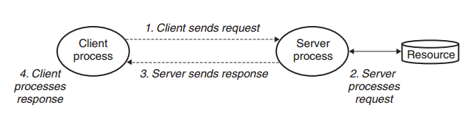
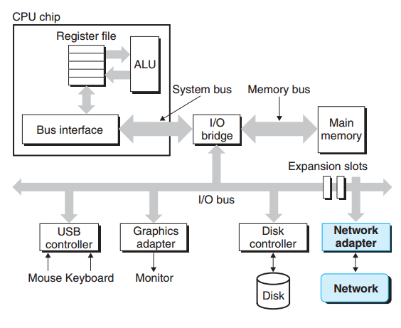
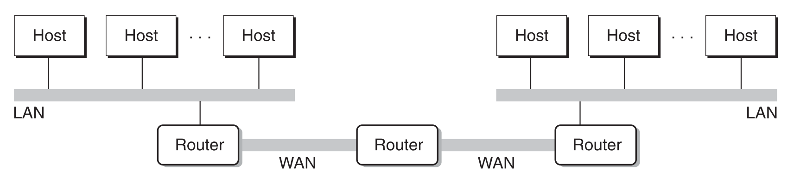
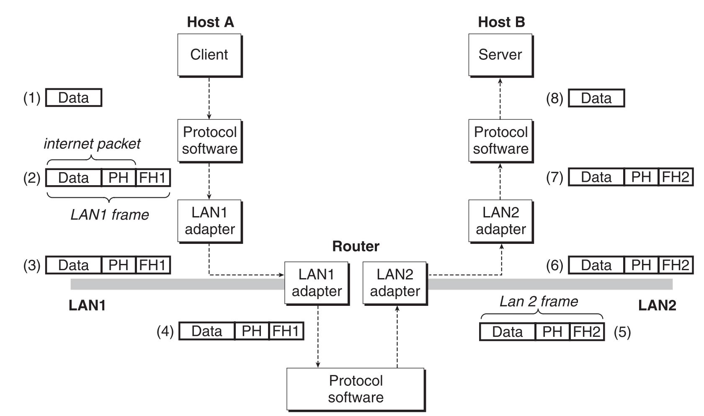
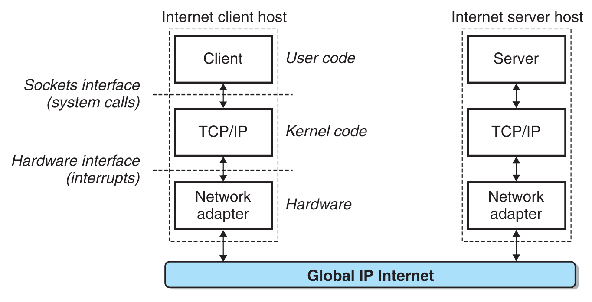

# 网络编程

现在我们处在一个网络的时代，无论是浏览网页、微信聊天，还是发电子邮件、在线游戏都是网络应用程序。但值得高兴的时，所有的网络应用都是基于相同的基本编程模型，有着相似的整体逻辑结构，并且依赖相同的编程接口。

这一章主要介绍的内容有：
- 客户端-服务器模型
- Web客户端-服务器程序
- 开发一个功能齐全的Web服务器 

# 1. 客户端-服务器编程模型

每个网络应用都基于客户端-服务器模型，采用这个模型，一个应用是由一个服务器进程和一个或者多个客户端进程组成的。

服务器管理某种资源，并且通过操作这种资源来为它的客户端提供某种服务。Web服务器管理着一组磁盘文件，它会为客户端提供检索和执行的服务。

客户端-服务器模型中的基本操作是事务（transaction）。一般由下面四步组成。
1. 当一个客户端需要服务时，它向服务器发送一个请求，发起一个事务。
2. 服务器收到请求后，解释它，并以适当的方式操作它的资源。
3. 服务器给客户端发送一个响应，并等待下一个请求。
4. 客户端收到响应并处理它。



这里说的客户端和服务器指的是两个进程，它们完全有可能运行在一台机器上，而且一台机器上可能运行有多个客户端或者服务器。

> 这里说的C-S的事务不是数据库中的事务，数据库中一般要求有事务原子性，对于C-S来说不要求，服务端可以同时处理多个客户端的事务请求。

# 2. 网络

一般而言，客户端和服务器通常运行在不同的主机上，并且通过计算机网络的硬件和软件资源来通信。网络是一个复杂的系统，这里我们进行适当的简化，我们从程序员的角度给出一个切实可行的思维模型。

对于主机而言，网络只是一种I/O设备，是数据源和数据接收方，和磁盘、终端没什么分别。如下图所示：一个插到I/O总线扩展槽的适配器提供了到网络的物理接口。

从网络上接收到的数据从适配器经过I/O和内存总线复制到内存，通常是通过DMA传送。相似地，数据也能从内存输出到网络。



## 2.1 网络的物理结构

物理上而言，网络是一个按照地理远近组成的层次系统。

- 最低层是LAN（Local Area Network，局域网), 在一个公司、小区或校园范围内。目前，最流行的局域网技术是以太网（Ethernet），以太网可以支持10Gb/s。
- 一个`以太网段`包括了一些电缆（通常是双绞线）和一个叫集线器的小盒子。集线器上有很多个端口，另一端和主机上的网络适配器连接。
- 每个以太网适配器都有一个全球唯一的48位地址。它存储在这个适配器的非易失性的存储器上。
- 通过集线器连接在一起的主机之间通信时是一种广播的方式，谁都可以接收。任何时刻，只有两个主机之间能进行通信。
- 多个以太网段通过网桥连接在一起可以组成较大的局域网。网桥与网桥以及网桥和集线器之间的数据传递是端口识别的，这样可以提高传输带宽。
- 在层次更高级别中，多不兼容的局域网可以通过叫做路由器(router)的特殊计算机连接起来，组成一个internet。也就是广域网(WAN, wid-Area Network)。

[关于网络设备：集线器、网桥、交换机、路由器的解释](https://blog.csdn.net/gongda2014306/article/details/52442981)



# 2.2 主机之间通网络的数据传输

互联网络的各个层次上通过协议来规定每个层次的行为，这个协议约束可以解决各个不兼容的局域网之间的数据通信。协议必须解决好两个重要的事情：一个是命名机制，互联网上的每台主机会被分配一个互联网地址，这个地址惟一的标识了这台主机。二是传送机制，数据在各层被包装上协议头形成数据包和数据帧进行传递。



上图展示了主机和路由器如何使用互联网协议在不兼容的局域网间传递数据的。整个过程大概有8个基本步骤。

1. 运行在主机A上的客户端进行一个系统调用，从客户端的虚拟地址空间复制数据到内核缓冲区上。
2. 主机A上的协议软件通过在数据前附加互联网络包头和LAN1帧头，创建一个LAN1帧。在互联网包头地址到互联网主机B。LAN1帧头寻址到路由器。然后它传送此帧到适配器。
3. LAN1适配器复制该帧到网络上。
4. 当此帧到达路由器时，路由器的LAN1适配器从电缆上读取它，并把它传送到协议软件。
5. 路由器从互联网包头中提取出目的互联网地址，并用它作为路由表的索引确定向哪里转发这个包。在本例中是LAN2，路由器剥落旧的LAN1的帧头，加上寻址到主机B的新的LAN2帧头，并把得到的帧传送到适配器。
6. 路由器的LAN2适配器复制该帧到网络上。
7. 当此帧到达主机B时，它的适配器从电缆上读取此帧，并将它传送到协议软件。
8. 最后，主机B上的协议软年剥落包头和帧头。当服务器进行一个读取这些数据的系统调用时，协议软件最终将得到的数据复制到服务喊叫虚拟地址空间。

这面描述的过程其实上省去了很多细节而且很难的问题，这里就不展开了，比如不同的网络有不同帧大小的最大值，该如何处理？路由器如何知道该往哪里转发帧呢？当网络的拓扑结构变化时，如何通知路由器？如果一个包丢失又该如何处理呢。

# 3. 全球IP因特网

全球IP因特网是最著名和最成功的互联网实现。下图展示了一个因特网客户端-服务器应用程序的基本硬件和软件组织。



每台因特网主机都运行着实现TCP/IP协议的软件，几乎每个现代计算机系统都支持这个协议。主机的客户端和服务器混 合使用套接字接口函数和UnixI/O函数来进行通信。通常套接字接口为系统调用，这些系统调用会陷入内核，并调用各种内核模式的TCP/IP函数。

TCP/IP是一个协义族，其中的每个协议都有不同的功能：
- IP协议提供基本的命名方法和递送机制，IP机制从某种意义上来说是不可靠的，因为数据报在网络中有丢失或重复的问题。
- UDP稍微扩展了IP协议，让包可以在进程间而不是主机间进行传送。
- TCP是一个构建在IP之上的复杂协议，提供了进程间全双工的连接。

我们这里不会对TCP/IP协议族进行过多的讨论，而是看它作为一个整体时能够为应用程序提供哪些功能。

从程序员的角度，我们可以把因特网看做一个世界范围的主机集合，满足以下特性：
- 主机集合被映射为一组32位的IP地址
- 这组IP地址被映射为一组称为因特网域名的标识符
- 因特网主机上的进程能够通过连接和任何其他因特网主机上的进程通信。

## 3.1 IP地址

一个IP地址就是一个32位无符号整数。它在Linux下的数据结构为：
```cpp
struct in_addr {
    uint32_t s_addr; // address in network byte order (big-endian)
}
```
把它包装成一个结构体，是早期实现不幸的产物，现在改过来已经太迟了。

不同的主机因为架构的不同，往往有着不同的主机字节顺序，TCP/IP为了任意整数数据项定义了统一的网络字节顺序，也就是大端字节顺序。所以当IP地址放在数据包中时，以是大端法的网络字节序存放的，即使主机字节顺序是小端法。 我们可以使用下面的函数在网络和主机字节顺序之间实现转换。

```cpp
#include <netinet/in.h>
unsigned long int htonl(unsigned long int hostlong); 
unsigned short int htons(unsigned short int hostshort);

unsigned long int ntohl(unsigned long int netlong); 
unsigned short int ntohs(unsigned short int netshort); 
```

另外linux还提供了一组函数方便，我们将一个32位的ip地址转换为一个点分十进制表示的字符串。
```cpp
///@brief 字符串格式转换为ip地址
///@return 若成功，则返回1，若src为非法点十进制地址，则返回0，若出错则为-1
#include <arpa/inet.h> 
int inet_pton(AF_INET, const char *src, void *dst); 
///@brief ip地址转换为字符串，并把结果的最多size的字节复制到dst中
///@return 若成功，则指向点分十进制字符串的指针，若出错则为NULL
char *inet_ntop(AF_INET, const void*src, char *dst, socklen_t size);
```

## 3.2 域名解析