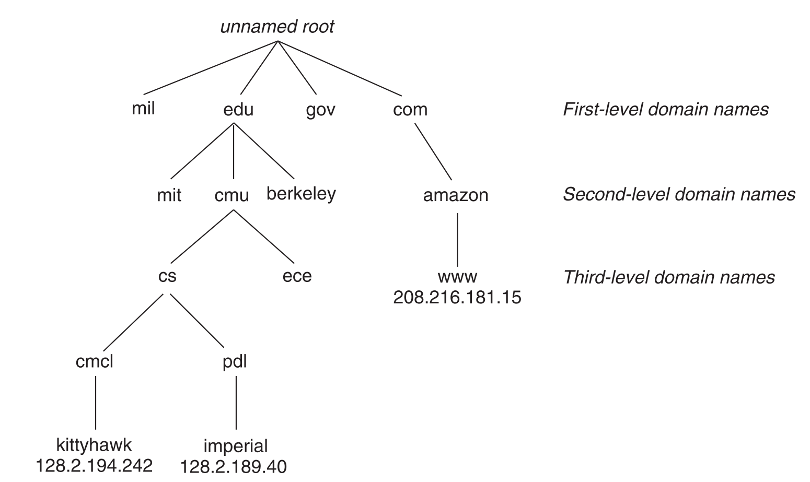
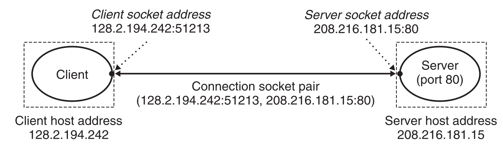

# 网络编程

现在我们处在一个网络的时代，无论是浏览网页、微信聊天，还是发电子邮件、在线游戏都是网络应用程序。但值得高兴的时，所有的网络应用都是基于相同的基本编程模型，有着相似的整体逻辑结构，并且依赖相同的编程接口。

这一章主要介绍的内容有：
- 客户端-服务器模型
- Web客户端-服务器程序
- 开发一个功能齐全的Web服务器 

# 1. 客户端-服务器编程模型

每个网络应用都基于客户端-服务器模型，采用这个模型，一个应用是由一个服务器进程和一个或者多个客户端进程组成的。

服务器管理某种资源，并且通过操作这种资源来为它的客户端提供某种服务。Web服务器管理着一组磁盘文件，它会为客户端提供检索和执行的服务。

客户端-服务器模型中的基本操作是事务（transaction）。一般由下面四步组成。
1. 当一个客户端需要服务时，它向服务器发送一个请求，发起一个事务。
2. 服务器收到请求后，解释它，并以适当的方式操作它的资源。
3. 服务器给客户端发送一个响应，并等待下一个请求。
4. 客户端收到响应并处理它。


这里说的客户端和服务器指的是两个进程，它们完全有可能运行在一台机器上，而且一台机器上可能运行有多个客户端或者服务器。

> 这里说的C-S的事务不是数据库中的事务，数据库中一般要求有事务原子性，对于C-S来说不要求，服务端可以同时处理多个客户端的事务请求。

# 2. 网络

一般而言，客户端和服务器通常运行在不同的主机上，并且通过计算机网络的硬件和软件资源来通信。网络是一个复杂的系统，这里我们进行适当的简化，我们从程序员的角度给出一个切实可行的思维模型。

对于主机而言，网络只是一种I/O设备，是数据源和数据接收方，和磁盘、终端没什么分别。如下图所示：一个插到I/O总线扩展槽的适配器提供了到网络的物理接口。

从网络上接收到的数据从适配器经过I/O和内存总线复制到内存，通常是通过DMA传送。相似地，数据也能从内存输出到网络。


## 2.1 网络的物理结构

物理上而言，网络是一个按照地理远近组成的层次系统。

- 最低层是LAN（Local Area Network，局域网), 在一个公司、小区或校园范围内。目前，最流行的局域网技术是以太网（Ethernet），以太网可以支持10Gb/s。
- 一个`以太网段`包括了一些电缆（通常是双绞线）和一个叫集线器的小盒子。集线器上有很多个端口，另一端和主机上的网络适配器连接。
- 每个以太网适配器都有一个全球唯一的48位地址。它存储在这个适配器的非易失性的存储器上。
- 通过集线器连接在一起的主机之间通信时是一种广播的方式，谁都可以接收。任何时刻，只有两个主机之间能进行通信。
- 多个以太网段通过网桥连接在一起可以组成较大的局域网。网桥与网桥以及网桥和集线器之间的数据传递是端口识别的，这样可以提高传输带宽。
- 在层次更高级别中，多不兼容的局域网可以通过叫做路由器(router)的特殊计算机连接起来，组成一个internet。也就是广域网(WAN, wid-Area Network)。

[关于网络设备：集线器、网桥、交换机、路由器的解释](https://blog.csdn.net/gongda2014306/article/details/52442981)


# 2.2 主机之间通网络的数据传输

互联网络的各个层次上通过协议来规定每个层次的行为，这个协议约束可以解决各个不兼容的局域网之间的数据通信。协议必须解决好两个重要的事情：一个是命名机制，互联网上的每台主机会被分配一个互联网地址，这个地址惟一的标识了这台主机。二是传送机制，数据在各层被包装上协议头形成数据包和数据帧进行传递。


上图展示了主机和路由器如何使用互联网协议在不兼容的局域网间传递数据的。整个过程大概有8个基本步骤。

1. 运行在主机A上的客户端进行一个系统调用，从客户端的虚拟地址空间复制数据到内核缓冲区上。
2. 主机A上的协议软件通过在数据前附加互联网络包头和LAN1帧头，创建一个LAN1帧。在互联网包头地址到互联网主机B。LAN1帧头寻址到路由器。然后它传送此帧到适配器。
3. LAN1适配器复制该帧到网络上。
4. 当此帧到达路由器时，路由器的LAN1适配器从电缆上读取它，并把它传送到协议软件。
5. 路由器从互联网包头中提取出目的互联网地址，并用它作为路由表的索引确定向哪里转发这个包。在本例中是LAN2，路由器剥落旧的LAN1的帧头，加上寻址到主机B的新的LAN2帧头，并把得到的帧传送到适配器。
6. 路由器的LAN2适配器复制该帧到网络上。
7. 当此帧到达主机B时，它的适配器从电缆上读取此帧，并将它传送到协议软件。
8. 最后，主机B上的协议软年剥落包头和帧头。当服务器进行一个读取这些数据的系统调用时，协议软件最终将得到的数据复制到服务喊叫虚拟地址空间。

这面描述的过程其实上省去了很多细节而且很难的问题，这里就不展开了，比如不同的网络有不同帧大小的最大值，该如何处理？路由器如何知道该往哪里转发帧呢？当网络的拓扑结构变化时，如何通知路由器？如果一个包丢失又该如何处理呢。

# 3. 全球IP因特网

全球IP因特网是最著名和最成功的互联网实现。下图展示了一个因特网客户端-服务器应用程序的基本硬件和软件组织。


每台因特网主机都运行着实现TCP/IP协议的软件，几乎每个现代计算机系统都支持这个协议。主机的客户端和服务器混 合使用套接字接口函数和UnixI/O函数来进行通信。通常套接字接口为系统调用，这些系统调用会陷入内核，并调用各种内核模式的TCP/IP函数。

TCP/IP是一个协义族，其中的每个协议都有不同的功能：
- IP协议提供基本的命名方法和递送机制，IP机制从某种意义上来说是不可靠的，因为数据报在网络中有丢失或重复的问题。
- UDP稍微扩展了IP协议，让包可以在进程间而不是主机间进行传送。
- TCP是一个构建在IP之上的复杂协议，提供了进程间全双工的连接。

我们这里不会对TCP/IP协议族进行过多的讨论，而是看它作为一个整体时能够为应用程序提供哪些功能。

从程序员的角度，我们可以把因特网看做一个世界范围的主机集合，满足以下特性：
- 主机集合被映射为一组32位的IP地址
- 这组IP地址被映射为一组称为因特网域名的标识符
- 因特网主机上的进程能够通过连接和任何其他因特网主机上的进程通信。

## 3.1 IP地址

一个IP地址就是一个32位无符号整数。它在Linux下的数据结构为：
```cpp
struct in_addr {
    uint32_t s_addr; // address in network byte order (big-endian)
}
```
把它包装成一个结构体，是早期实现不幸的产物，现在改过来已经太迟了。

不同的主机因为架构的不同，往往有着不同的主机字节顺序，我们平时用的主机大多是Intel架构，一般都是小端表示法。TCP/IP为了任意整数数据项定义了统一的网络字节顺序，也就是大端字节顺序。所以当IP地址放在数据包中时，以是大端法的网络字节序存放的，即使主机字节顺序是小端法。 

假设变量`x`的类型为`int`，位于地址0x100处，它的十六进制值为0x01234567。地址范围0x100~0x103的字节顺序在大端法机器与小端法机器上表现如下：


从上图可以看出来，小端表示法符合直觉，也就是数的高有效位存在高地址。

我们可以使用下面的函数在网络和主机字节顺序之间实现转换。

```cpp
#include <netinet/in.h>
unsigned long int htonl(unsigned long int hostlong); 
unsigned short int htons(unsigned short int hostshort);

unsigned long int ntohl(unsigned long int netlong); 
unsigned short int ntohs(unsigned short int netshort); 
```

另外linux还提供了一组函数方便，我们将一个32位的ip地址转换为一个点分十进制表示的字符串。
```cpp
///@brief 字符串格式转换为二进制的网络字节序ip地址
///@return 若成功，则返回1，若src为非法点十进制地址，则返回0，若出错则为-1
#include <arpa/inet.h> 
int inet_pton(AF_INET, const char *src, void *dst); 
///@brief 二进制的网络字节序ip地址转换为字符串，并把结果的最多size的字节复制到dst中
///@return 若成功，则指向点分十进制字符串的指针，若出错则为NULL
char *inet_ntop(AF_INET, const void*src, char *dst, socklen_t size);
```

我们可以借助上面的函数，我们实现以下程序，将从命令行读往个十六进制的ip地址，转换为点分址进制的可读格式。

```cpp
#include <cstdio>
#include <iostream>
#include <arpa/inet.h>

int main(int argc, char *argv[]) {
    uint32_t ip;
    sscanf(argv[1], "%x", &ip);     /*按十六进制读入一个ip地址*/
    uint32_t ip_net = htonl(ip);    /*将这个ip地址由主机字节序转化为网络字节序*/


    char ip_string[32];
    inet_ntop(AF_INET, &ip_net, ip_string, 32); /*将网络字节序的ip地址，转换为字符串格式*/

    std::cout << ip_string << std::endl;

    return 0;
};
```

## 3.2 域名解析

Internet中标记主机用的都是IP地址，但大量的IP地址对人来说是很难记忆的，所以Internet上有一个分布式的数据库建立了IP地址与其助记符（域名）之间的映射关系。这个分布式的数据据就是域名解析系统（DNS)。

这些域名是一串用句点分割的单词（字母、数字和破折号），例如`www.baidu.com`。

这个分布式的域名数据库被组织成了一个分层的结构，最上一层是未命名的根，然后是第一层域名，一般是`.com`,`.cn`这样的一级域名。下一层是二级域名，例如:`baidu.com`。

我们可以使用Linux上的`nslook`命令来查看一个域名，它对应的ip地址。一个域名可能对应一个或多个ip地址。



域名解析实际是一个网络核心的功能，但确使用了应用层的协议。域名解析在传输层一般会选择UDP协议。域名解析的详细过程可以阅读[从输入url到页面展示到底发生了什么](https://www.cnblogs.com/xianyulaodi/p/6547807.html)。

## 3.3 网络程序连接

互联网上的客户端与服务器程序建立点对点的连接，通过这个连接来发送与接收字节流信息。数据可以双向流动，是全双工的。这个连接的两端是一个叫套接字的端点，每个端点都有对应的套接字地址，它是由一个IP地址和一个16位的整数端口组成。所以一般表示为：“地址：端口号”的形式。

当客户端发起一个连接请求时，客户端的套接字的端口是由内核自动分配的，称为临时端口。然后服务器端的端口一般是知名端口，根据服务器提供的服务，一般都有约定俗成的端口号，比如Web服务器通常使用80，电子邮件服务器通常使用25，SSH服务器一般使用22。

下图展示了一具客户端与一个服务器通过一个套接字对连接的示意图：




# 4. 套接字API

套接字API是一组函数，它们和Unix I/O函数结合起来，用于创建网络应用。现在大多数的操作系统上都实现了套接字接口，我们要以方便的调用这些接口来实现我们想要的网络应用。

我们先从一次典型的客户端-服务器的事务开始分析，看客户端与服务器是怎样通过调用`socket API`进行事务处理的。下面的图对整个过程进行了描述：


## 4.1 客户端的行为

先看客户端在这个事务中按时间先后都有哪些行为：

1. 客户端需要操作系统提供的网络数据传输的功能，必须先使用`socket`函数创建一个套接字，用这个套接字来进行数据传递，在后续的数据读写过程中就把这个套接字看成是一个文件描述符。
2. 光创建一个套接字，只是相当于在客户端创建了一个端口，这个端口并未进行连接，所以需要调`connect`函数，来与远程的服务器进行连接，`connect`函数必须知道远程服务器的IP地址和端口号。这些IP地址和端口号，以及使用的协议被封装成了一个叫Socket地址`sockaddr`的结构。`connect`会把客户端套接字描述符与服务器端的socket地址连接在一起。
3. 上面的两步，我们把它合并称为`open_clientfd`。也就是创建套接字，并连接远程服务器。
4. 一旦`connect`调用成功，就说明，可以和服务端进行通信了，那我们可以采用一种通信协议，比如HTTP的请求响应式的规则来与服务器进行数据交换。
5. 调用`roi_writen`函数向服务器发起服务请求消息。
6. 调用`rio_readlineb`函数来接收服务器响应消息。
7. 这些请求-响应结束后，关闭连接。


## 4.2 服务器的行为

1. 服务器要对外提供服务，首先需要在服务器端创建套接字。
2. 调用`bind`函数，将套接字与服务器的套接字地址（IP地址+端口号）进行绑定。
3. 客户端是发起连接请求的主动实体，服务器是等待来自客户端连接请求的被动实体。默认情况下，内核会认为`socket`函数创建的描述符对应于主动套接字，它存在于一个连接的客户端。 服务器调用`listen`函数告诉内核，描述符是服务器而不是客户端使用的。`listen`将sockfd从一个主动套接字转换为一个监听套接字。这个套接字可以处理来自客户端的连接请求，并且把所有的连接请求都放在队列中，这个队列的长度，可以通过`listen`的参数控制，当队列满的时候，服务器就不再接收连接请求了。
4. 服务端将调用`accept`函数来从监听套接字描述符那边获取客户端的连接请求，内部创建一个新的套接字，叫已连接描述符，这个描述符是专门用来处理当前的这个客户端连接请求的。`accept`还将客户端那边的套接字地址信息传了出来。
5. 服务端调用`roi_readlineb`来从已连接的描述符那里取请求消息，并经过处理后，把客户端请求的结果通过`roi_writen`发送给客户端。并待客户端发来的下一条命令。
6. 若客户端没有请的请求命令发送过来了，则服务端会收到EOF标识符，服务端就会关闭这个已连接的描述符，停止处理刚才那个客户端的请求了。

> 监听描述符与已连接描述符之间的区别：这一点很容易让初学者迷惑。监听描述符是用于处理客户端的连接请求的，它通常只创建一次，并在服务器服务程序的整个生命周期中。已连接描述符是服务端用于专门处理客户端的某一个连接的端点。服务器每处理一个客户端的连接请求，就会创建一个，并且当这个客户端的请求处理完后，就关闭了。

## 4.3 `ip:port`号与`sockaddr`之间的转换

通过Socket的API我们知道，不论是客户端还是服务端，都需要将套接字描述符与服务端套接字地址绑定在一地。所以我们需要构建`sockaddr`这个结构，这个结构如下：
```cpp
struct sockaddr_in {
    uint16_t        sin_family;     // 协议族，一般都是AF_INET
    uint16_t        sin_port;       // 端口号
    struct in_addr  sin_addr;       // 网络字节序的ip地址
    unsigned char   sin_zeros[8];   // 补白 
};

struct sockaddr {
    uint16_t        sa_family;      // 协议族
    char            sa_data[14];    // 地址信息
};
```

`sockaddr`是套接字地址的通用格式，不止适用于TCP/IP协议栈，`sockaddr_in`是适应于TCP/IP协议的一个具体化的格式，它在内存大小上是适配`sockaddr`的。socket的接口为了保证通用性一般都是用`sockaddr`为作参数类型，而我们可以将它与`sockaddr_in`类型的套接字地址进行转换。

从`sockaddr_in`结构中可以看出，我们如果要使用socketAPI进行编写Interet网络程序，必须填写地址与端口号来组成一个套接字地址格式。那我们往往需要几步：

1. 将一个域名，比如`smtp.qq.com`转换为32位网络字节序的ip地址。
2. 将SMTP协议，转换为端口号为22的网络字节序。

我们需要调用域名解析函数，以及主机与网络字节序之间的转换函数，整个过程比较烦索，SocketAPI提供了一对辅助函数`getaddrinfo`和`getnameinfo`来实现二进制套接字地址结构和主机名、主机址、服务名和端口的字符串表示之间相互转化。

知道服务器名和服务名，或服务器IP地址和端口号，如何创建一个`sockaddr`对象呢。

```cpp
#include <sys/types.h>
#include <sys/socket.h>
#include <netdb.h>

/// @brief 根据提供的主机名或ip地址字行串 + 服务名或服务端口号字符串，获取对应的套接字地址
/// @param[in] host 主机名或ip地址字行串 
/// @param[in] service 服务名或服务端口号字符串
/// @param[in] hints 控制参数，可以控制套接字地址里的ai_socket_type、ai_protocol及ai_flags
/// @param[out] result 指向addrinfo结构的链表，一般来说链表长度为1，当一个域名对应多个ip时，链表可能有多个项。
/// @return 成功，则返回0，如果错误则为在零的错误码，可调用gai_strerror来解析该错误码。
int getaddrinfo(const char *host, const char *service,
                const struct addrinfo *hints,
                struct addrinfo **result);

/// @brief 释放结构链表                
void freeaddrinfo(struct addrinfo *result);

/// @breif 返回错误码对应的字符串
const char *gai_strerror(int errcode);

```

值得注意的是客户端程序和服务端程序一般都会调用`getaddrinfo`，但调用时使用的参数却不同。对于客户端会把hints参数的ai_flags域设置为AI_ADDRCONFIG，表示主动形的连接。而服务端会设置AI_PASSIVE标志，并将host参数设置为NULL，每个套接字地址结构中的地址字段会被设置为通配符地址，这告诉内核这个服务器会接收发送到本主机所有IP地址的请求。

相反，`getnameinfo `将一个套接字地址结构转换成相应的主机和服务名字符串。

```cpp
#include <sys/socket.h>
#include <netdb.h>

///@breif 根据套接字地址，返回主机名和服务名
///@param[in] sa 指向大小为salen字节的套接字地址结构
///@param[in] host 存放主机名字符串的缓冲区
///@param[in] service 存放服务名的字符串缓冲区
///@param[in] flags 用于控制返回的是数值字符串还是名称字符串
int getnameinfo(const struct sockaddr *sa, socklen_t salen,
                const *host, size_t hostlen,
                char *service, size_t servlen, int flags);
```

